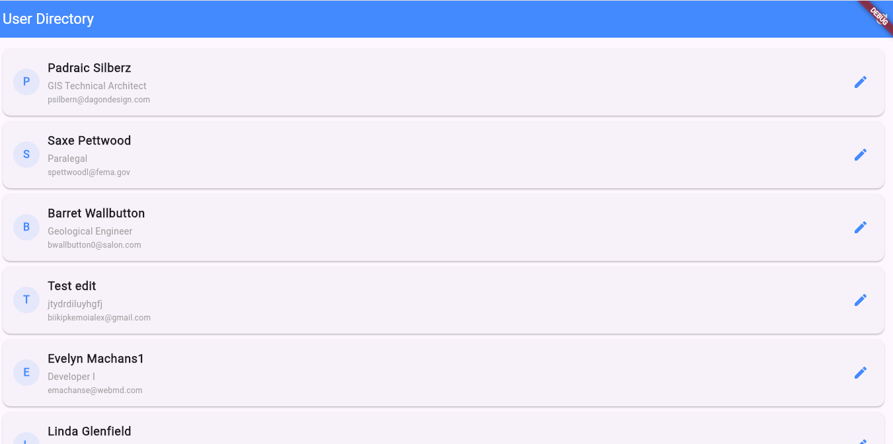
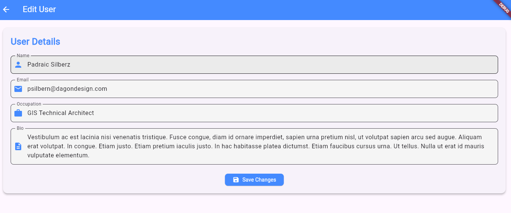

# Frontend Test

A Flutter-based mobile and web application for managing users, featuring a user list fetched from an external API and an edit functionality. Built with clean architecture using the Provider state management library.

## Features
- Displays a list of users fetched from `https://frontend-interview.touchinspiration.net/api/users`.
- Fallback to mock data if the API fails.
- Edit user details (name, email, occupation, bio) with real-time updates.
- Cross-platform: Runs on Android, iOS, and Web (Chrome).
- Responsive UI with loading states and error handling.

## Screenshots



## Getting Started

### Prerequisites
- **Flutter**: Version 3.19.x or later (run `flutter --version` to check).
- **Dart**: Included with Flutter (2.19.x or later).
- **Android Studio**: For Android emulator setup (optional).
- **Git**: To clone the repository.
- **IDE**: VS Code or Android Studio recommended.

### Installation
1. **Clone the Repository**:
   ```bash
   git clone https://github.com/<your-username>/frontend_test.git
   cd frontend_test
   ```

2. **Install Dependencies**:
   ```bash
   flutter pub get
   ```

3. **Set Up Environment**:
   - **Android**: 
     - Install Android Studio and set up an emulator (e.g., Pixel 6, API 34).
     - Add `<uses-permission android:name="android.permission.INTERNET" />` to `android/app/src/main/AndroidManifest.xml`.
   - **Web**: No additional setup needed beyond Flutter.
   - Ensure your device/emulator has internet access for API calls.

### Running the App
- **Android Emulator**:
  1. Start an emulator via Android Studio (`AVD Manager > Play`).
  2. Run:
     ```bash
     flutter run -d <device-id>
     ```
     (Find `<device-id>` with `flutter devices`, e.g., `emulator-5554`).
- **Web (Chrome)**:
  ```bash
  flutter run -d chrome
  ```
- **Verbose Mode** (for debugging):
  ```bash
  flutter run --verbose -d <device-id>
  ```

### Project Structure
```
frontend_test/
├── android/              # Android-specific files
├── lib/                  # Main Dart code
│   ├── models/           # Data models (e.g., User)
│   ├── providers/        # State management (UserProvider)
│   ├── screens/          # UI screens (UserListScreen, UserEditScreen)
│   ├── services/         # API service (ApiService)
│   └── main.dart         # Entry point
├── pubspec.yaml          # Dependencies and configuration
└── README.md             # This file
```

### Dependencies
- `flutter`: Core SDK.
- `provider`: State management.
- `http`: HTTP requests for API calls.

```yaml
dependencies:
  flutter:
    sdk: flutter
  provider: ^6.0.0
  http: ^1.0.0
```

## Usage
- **User List**: On launch, the app fetches users from the API or uses mock data if the request fails. Tap the refresh button to retry.
- **Edit User**: Tap a user in the list to edit their details. Save updates via the API (if supported) or locally with mock data.
- **Error Handling**: Displays error messages if the API fails or user IDs are missing.

## Debugging
- **Logs**: Check terminal output or Android Studio’s Logcat for `ApiService` and `UserProvider` logs.
- **Web**: Use Chrome DevTools (`F12 > Console`) for logs when running on Chrome.
- **Common Issues**:
  - **CORS**: Web runs may fail due to CORS; Android avoids this.
  - **API Down**: Mock data (Barret, Alice) loads if the API is unavailable.


## License
This project is licensed under the MIT License - see the [LICENSE](LICENSE) file for details.

## Contact
- GitHub: [joehack1](https://github.com/<joehack1>)
- Email: [joelluke100@gmail.com](mailto:joelluke100@gmail.com)

---

